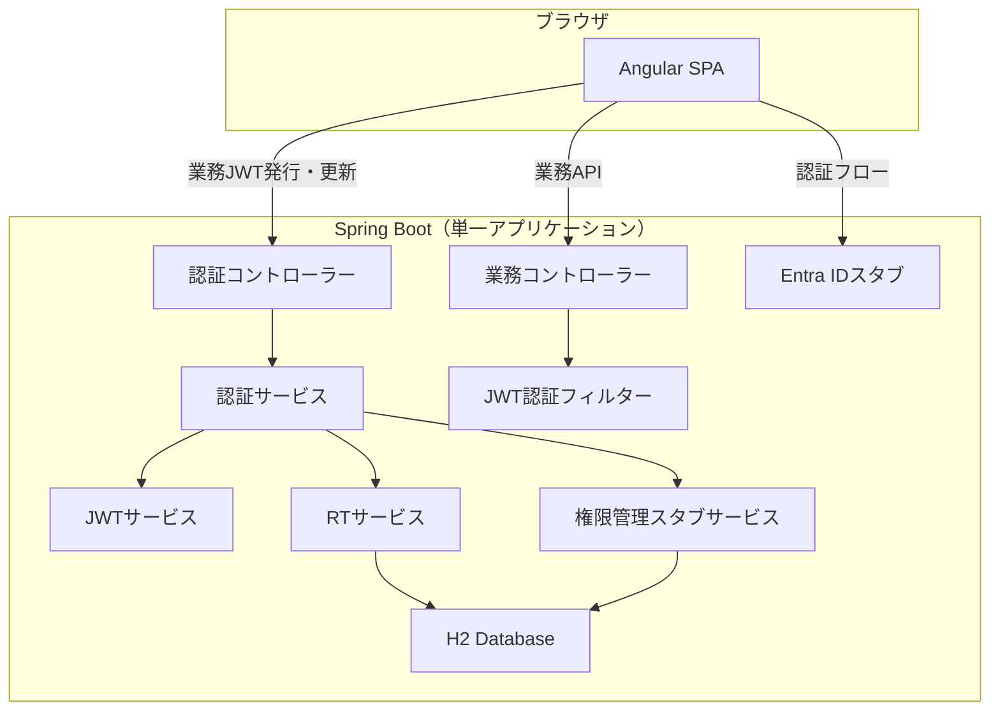
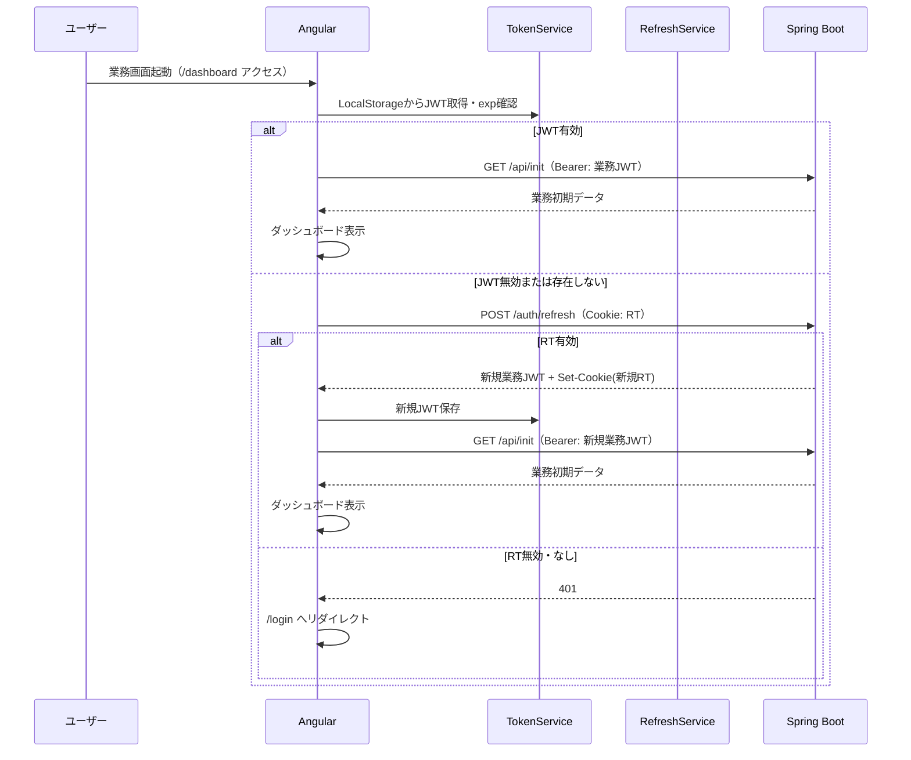
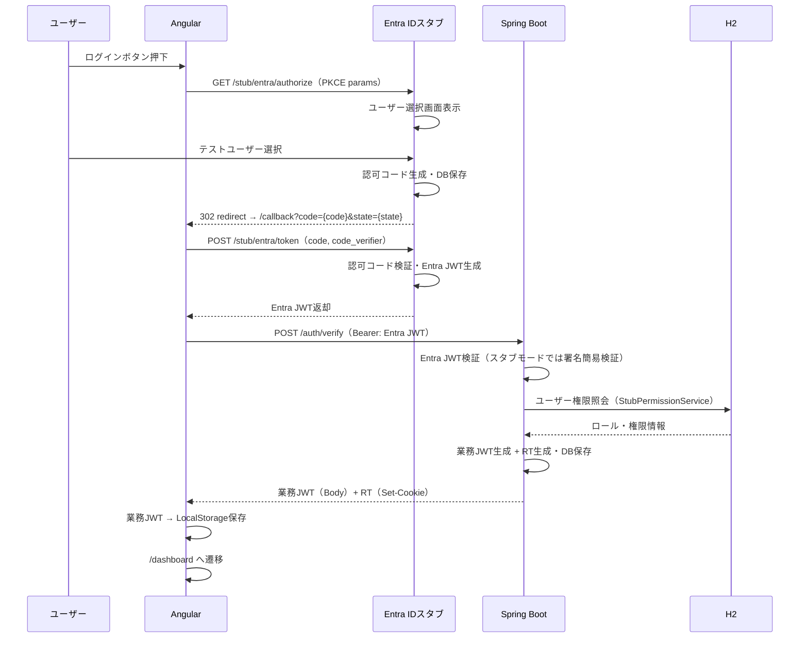
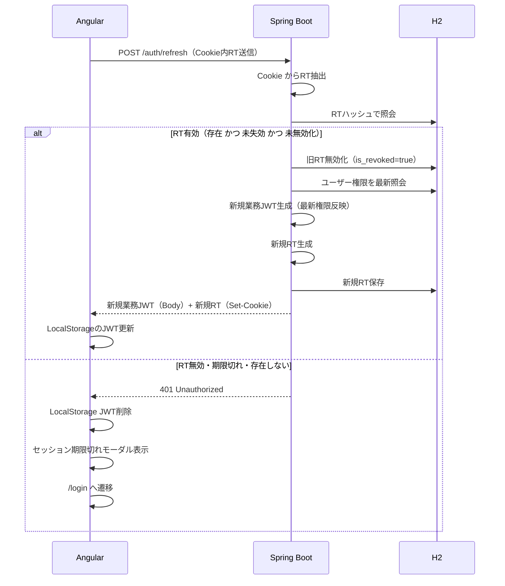

# 認証・認可機能 フロントエンド・バックエンド実装設計書

## 1. 概要

### 1.1 目的

基本設計書（基本設計.md）およびシーケンス図（auth_sequence_ver5.puml）に基づき、認証・認可機能のフロントエンド（Angular）およびバックエンド（Java Spring Boot）の実装設計を定義する。

### 1.2 実装方針

| 項目 | 方針 |
|------|------|
| フロントエンド | Angular（SPA） |
| バックエンド | Java Spring Boot（単一アプリケーション） |
| データベース | H2（インメモリ、開発用） |
| 外部連携 | Entra ID・権限管理APIはスタブで代替 |
| 業務画面 | 認証・認可基盤 + サンプル業務画面 |

### 1.3 スタブ対象と代替方式

| 外部システム | スタブ方式 | 説明 |
|-------------|----------|------|
| Azure Entra ID | バックエンド内スタブエンドポイント | 認可コード発行・Entra JWT返却を模擬 |
| 権限管理API | バックエンド内スタブサービス | DB上の固定データからロール・権限情報を返却 |
| 外部連携GW | 省略（バックエンド直接処理） | 業務アプリへの転送をバックエンド内で直接実行 |

### 1.4 コンポーネント対応表（設計書 vs 実装）

| シーケンス図上の名称 | 基本設計上の名称 | 実装先 |
|--------------------|----------------|--------|
| ブラウザ | クライアント | Angular SPA |
| 業務API | AWS 権限管理APIコンテナー | Spring Boot（認証・JWT発行系エンドポイント） |
| 業務アプリ | AWS アプリケーションコンテナー | Spring Boot（業務系エンドポイント） |
| 外部連携GW | 外部連携ゲートウェイ | Spring Boot内で直接ルーティング（省略） |
| Entra ID | Azure Entra ID | Spring Boot内スタブエンドポイント |
| 権限管理API | 社内共通権限管理API | Spring Boot内スタブサービス |

---

## 2. システム構成

### 2.1 全体構成



### 2.2 通信概要

| 通信経路 | プロトコル | 認証方式 |
|---------|----------|---------|
| Angular → Entra IDスタブ | HTTP (localhost) | なし（認証開始フロー） |
| Angular → 認証API | HTTP | Bearer Entra JWT / Cookie RT |
| Angular → 業務API | HTTP | Bearer 業務JWT |

---

## 3. フロントエンド設計（Angular）

### 3.1 モジュール構成

| モジュール | 責務 |
|-----------|------|
| AppModule | ルートモジュール、ルーティング定義 |
| CoreModule | シングルトンサービス、インターセプター、ガード |
| AuthModule | ログイン画面、コールバック画面、ログアウト画面 |
| BusinessModule | サンプル業務画面（ダッシュボード、メニュー、データ操作） |
| SharedModule | 共有コンポーネント（エラー表示、ローディング等） |

### 3.2 コンポーネント設計

| コンポーネント | モジュール | 画面ID | 責務 |
|--------------|----------|--------|------|
| LoginComponent | Auth | SCR-01 | ログインボタン表示、セッション有効性チェック起点 |
| CallbackComponent | Auth | - | Entra ID認証コールバック処理（認可コード受取・トークン交換） |
| LogoutCompleteComponent | Auth | - | ログアウト完了画面表示 |
| DashboardComponent | Business | SCR-03 | 業務初期画面（ログイン後ランディング） |
| MenuComponent | Business | SCR-04 | メニュー表示（権限に基づく表示制御） |
| SampleDataComponent | Business | SCR-04 | サンプル業務データ操作画面（CRUD操作デモ） |
| AuthErrorComponent | Shared | SCR-E1 | 認証エラー表示（401） |
| ForbiddenErrorComponent | Shared | SCR-E2 | 認可エラー表示（403） |
| SessionExpiredModalComponent | Shared | - | セッション期限切れ通知モーダル |

### 3.3 サービス設計

| サービス | モジュール | 責務 |
|---------|----------|------|
| AuthService | Core | ログイン開始（Entra IDスタブへリダイレクト）、認可コード→Entra JWT交換、業務JWT発行要求、ログアウト要求 |
| TokenService | Core | LocalStorageへの業務JWT保存・取得・削除、exp有効期限判定 |
| RefreshService | Core | RT更新要求（/auth/refresh呼出）、更新成功時のJWT保存、更新失敗時のセッション終了処理 |
| ApiService | Core | 業務API呼び出し（HTTPクライアントラッパー） |
| PermissionService | Core | 業務JWTからroles・permissions抽出、メニュー表示可否判定 |

### 3.4 ルーティング・ガード設計

| パス | コンポーネント | ガード | 説明 |
|-----|--------------|-------|------|
| /login | LoginComponent | なし | ログイン画面 |
| /callback | CallbackComponent | なし | Entra IDコールバック |
| /dashboard | DashboardComponent | AuthGuard | 業務初期画面 |
| /menu | MenuComponent | AuthGuard | メニュー画面 |
| /business/data | SampleDataComponent | AuthGuard, PermissionGuard | サンプル業務画面 |
| /error/auth | AuthErrorComponent | なし | 認証エラー |
| /error/forbidden | ForbiddenErrorComponent | なし | 認可エラー |
| /logout | LogoutCompleteComponent | なし | ログアウト完了 |

**AuthGuard の処理フロー:**

```mermaid
flowchart TD
    A[ルートアクセス] --> B{TokenService: JWT存在 かつ exp有効?}
    B -- Yes --> C[アクセス許可]
    B -- No --> D[RefreshService: RT更新要求]
    D --> E{更新成功?}
    E -- Yes --> F[TokenService: 新JWT保存] --> C
    E -- No --> G[/login へリダイレクト]
```

**PermissionGuard の処理フロー:**
- PermissionServiceから現在ユーザーのpermissionsを取得
- ルート定義のdata属性に指定された必要権限と照合
- 権限不足の場合は /error/forbidden へ遷移

### 3.5 インターセプター設計

| インターセプター | 責務 |
|----------------|------|
| AuthInterceptor | 全HTTPリクエスト（/stub/**, /auth/** 以外）にAuthorization: Bearer {業務JWT} ヘッダーを付与 |
| ErrorInterceptor | HTTPエラーレスポンスをハンドリング（後述） |

**ErrorInterceptor の401処理フロー:**

```mermaid
flowchart TD
    A[HTTPレスポンス受信] --> B{ステータスコード?}
    B -- 401 --> C{RT更新 未試行?}
    C -- Yes --> D[RefreshService: RT更新要求]
    D --> E{更新成功?}
    E -- Yes --> F[元リクエストを新JWTでリトライ]
    E -- No --> G[セッションクリア → /login遷移]
    C -- No --> G
    B -- 403 --> H[/error/forbidden へ遷移]
    B -- 500 --> I[システムエラー通知表示]
    B -- Other --> J[エラー通知表示]
```

### 3.6 環境設定（environment）

| 設定項目 | 開発環境（スタブ） | 本番環境 |
|---------|-------------------|---------|
| apiBaseUrl | http://localhost:8080 | 本番APIのURL |
| entraAuthorizeUrl | http://localhost:8080/stub/entra/authorize | Azure Entra ID認可エンドポイント |
| entraTokenUrl | http://localhost:8080/stub/entra/token | Azure Entra IDトークンエンドポイント |
| clientId | stub-client-id | 実際のAzure Client ID |
| redirectUri | http://localhost:4200/callback | 本番コールバックURL |
| useStub | true | false |

---

## 4. バックエンド設計（Java Spring Boot）

### 4.1 レイヤー構成

| レイヤー | パッケージ | 責務 |
|---------|----------|------|
| Controller | controller | HTTPリクエスト受付、レスポンス返却 |
| Service | service | ビジネスロジック（認証・認可・JWT管理） |
| Repository | repository | データアクセス（Spring Data JPA） |
| Security | security | Spring Security設定、JWTフィルター |
| Model | model | エンティティ、DTO定義 |
| Stub | stub | Entra ID・権限管理APIスタブ実装 |
| Config | config | アプリケーション設定 |

### 4.2 APIエンドポイント設計

#### 認証API

| エンドポイント | メソッド | 責務 | 入力 | 出力 |
|--------------|---------|------|------|------|
| /auth/verify | POST | Entra JWT検証→業務JWT+RT発行 | Header: Bearer {Entra JWT} | Body: 業務JWT / Cookie: RT |
| /auth/refresh | POST | RT検証→業務JWT+RT再発行（RTローテーション） | Cookie: RT | Body: 新規業務JWT / Cookie: 新規RT |
| /auth/logout | POST | RT無効化・Cookie削除 | Cookie: RT | Cookie: RT削除 / 200 OK |

#### 業務API（サンプル）

| エンドポイント | メソッド | 責務 | 必要権限 |
|--------------|---------|------|---------|
| /api/init | GET | 業務初期データ返却 | 認証済み（権限不問） |
| /api/menu/permissions | GET | ログインユーザーのメニュー権限情報返却 | 認証済み（権限不問） |
| /api/business/data | GET | サンプル業務データ一覧取得 | user:read |
| /api/business/data | POST | サンプル業務データ登録 | user:write |
| /api/business/data/{id} | PUT | サンプル業務データ更新 | user:write |
| /api/business/data/{id} | DELETE | サンプル業務データ削除 | user:delete |

#### Entra IDスタブAPI

| エンドポイント | メソッド | 責務 |
|--------------|---------|------|
| /stub/entra/authorize | GET | 認可エンドポイント模擬（認可コード生成→redirect_uriへリダイレクト） |
| /stub/entra/token | POST | トークンエンドポイント模擬（認可コード検証→固定Entra JWT返却） |

### 4.3 サービス設計

| サービス | 責務 |
|---------|------|
| AuthenticationService | Entra JWT検証委譲、業務JWT発行指示、RT発行指示の統合制御 |
| JwtService | 業務JWTの生成（署名・クレーム埋め込み）、検証（署名・exp・iss確認）、クレーム抽出 |
| RefreshTokenService | RT生成（ランダム文字列）、DB保存（ハッシュ化）、検証、ローテーション（旧RT無効化+新RT発行）、無効化 |
| UserService | ユーザー情報のDB照会 |
| StubEntraService | 認可コード生成・管理、固定Entra JWT生成 |
| StubPermissionService | user_idに基づくロール・権限情報のDB照会（権限管理APIの代替） |

### 4.4 セキュリティ設定

**Spring Security FilterChain 構成:**

| 処理順序 | フィルター | 責務 |
|---------|----------|------|
| 1 | CorsFilter | CORS設定（Angular開発サーバー許可） |
| 2 | JwtAuthenticationFilter | Authorizationヘッダーから業務JWT抽出・検証・SecurityContext設定 |

**エンドポイント認証ルール:**

| URLパターン | 認証要否 | 説明 |
|------------|---------|------|
| /auth/** | 不要 | 認証系API（verify, refresh, logout） |
| /stub/** | 不要 | Entra IDスタブ |
| /api/** | 必要 | 業務API（JwtAuthenticationFilter による業務JWT検証） |
| /h2-console/** | 不要 | H2コンソール（開発用） |

**CORS設定:**

| 項目 | 値 |
|------|-----|
| Allowed Origins | Angular開発サーバーURL（localhost:4200） |
| Allowed Methods | GET, POST, PUT, DELETE, OPTIONS |
| Allowed Headers | Authorization, Content-Type |
| Allow Credentials | true（Cookie送受信のため） |

### 4.5 JWT管理方針

**業務JWT:**

| 項目 | 仕様 |
|------|------|
| 署名アルゴリズム | HS256 |
| ペイロードクレーム | sub（ユーザーID）, roles, permissions, email, display_name, iat, exp, iss |
| issuer | auth-server |
| 有効期限 | 15分（application.yml で設定可能） |

**リフレッシュトークン（RT）:**

| 項目 | 仕様 |
|------|------|
| 形式 | Opaque（セキュアランダム文字列） |
| DB保存 | ハッシュ化して保存（SHA-256） |
| 有効期限 | 8時間（application.yml で設定可能） |
| ローテーション | 使用のたびに旧RT即時無効化→新RT発行 |
| Cookie属性 | HttpOnly, Secure（開発時はSecure省略可）, SameSite=Lax, Path=/auth |

### 4.6 データモデル

#### テーブル一覧

| テーブル | 責務 |
|---------|------|
| users | ユーザーマスタ |
| roles | ロールマスタ |
| user_roles | ユーザー・ロール関連 |
| role_permissions | ロール・権限関連 |
| refresh_tokens | リフレッシュトークン管理 |
| stub_auth_codes | スタブ用認可コード一時保存 |

#### users

| カラム | 型 | 制約 | 説明 |
|--------|-----|------|------|
| user_id | VARCHAR(255) | PK | Entra IDサブジェクト |
| email | VARCHAR(255) | NOT NULL | メールアドレス |
| display_name | VARCHAR(255) | NOT NULL | 表示名 |
| is_active | BOOLEAN | NOT NULL, DEFAULT TRUE | 有効フラグ |
| created_at | TIMESTAMP | NOT NULL | 作成日時 |
| updated_at | TIMESTAMP | NOT NULL | 更新日時 |

#### roles

| カラム | 型 | 制約 | 説明 |
|--------|-----|------|------|
| role_id | VARCHAR(50) | PK | ロールID |
| role_name | VARCHAR(100) | NOT NULL | ロール名 |
| description | VARCHAR(255) | | 説明 |

#### user_roles

| カラム | 型 | 制約 | 説明 |
|--------|-----|------|------|
| user_id | VARCHAR(255) | PK, FK(users) | ユーザーID |
| role_id | VARCHAR(50) | PK, FK(roles) | ロールID |
| assigned_at | TIMESTAMP | NOT NULL | 付与日時 |

#### role_permissions

| カラム | 型 | 制約 | 説明 |
|--------|-----|------|------|
| role_id | VARCHAR(50) | PK, FK(roles) | ロールID |
| resource | VARCHAR(100) | PK | リソース名 |
| action | VARCHAR(50) | PK | アクション名 |

#### refresh_tokens

| カラム | 型 | 制約 | 説明 |
|--------|-----|------|------|
| id | BIGINT | PK, AUTO INCREMENT | 連番 |
| token_hash | VARCHAR(255) | UNIQUE, NOT NULL | RTハッシュ値（SHA-256） |
| user_id | VARCHAR(255) | FK(users), NOT NULL | ユーザーID |
| expires_at | TIMESTAMP | NOT NULL | 有効期限 |
| is_revoked | BOOLEAN | NOT NULL, DEFAULT FALSE | 無効化フラグ |
| created_at | TIMESTAMP | NOT NULL | 作成日時 |

#### stub_auth_codes

| カラム | 型 | 制約 | 説明 |
|--------|-----|------|------|
| code | VARCHAR(255) | PK | 認可コード |
| user_id | VARCHAR(255) | NOT NULL | 対象ユーザーID |
| redirect_uri | VARCHAR(500) | NOT NULL | リダイレクト先 |
| created_at | TIMESTAMP | NOT NULL | 作成日時 |
| expires_at | TIMESTAMP | NOT NULL | 有効期限（短期: 5分） |

### 4.7 初期データ（H2起動時投入）

**ユーザー:**

| user_id | email | display_name | is_active |
|---------|-------|-------------|-----------|
| stub-user-001 | test-admin@example.com | テスト管理者 | true |
| stub-user-002 | test-user@example.com | テスト一般 | true |
| stub-user-003 | test-guest@example.com | テストゲスト | true |

**ロール:**

| role_id | role_name |
|---------|-----------|
| ADMIN | システム管理者 |
| USER | 一般ユーザー |
| GUEST | ゲスト |

**ユーザー・ロール割当:**

| user_id | role_id |
|---------|---------|
| stub-user-001 | ADMIN |
| stub-user-002 | USER |
| stub-user-003 | GUEST |

**ロール・権限割当:**

| role_id | resource | action |
|---------|----------|--------|
| ADMIN | user | read |
| ADMIN | user | write |
| ADMIN | user | delete |
| USER | user | read |
| USER | user | write |
| GUEST | user | read |

---

## 5. スタブ設計

### 5.1 Entra IDスタブ

**目的:** Azure Entra IDのAuthorization Code Flow with PKCEを模擬し、開発環境で認証フローを完結させる。

**スタブ認可エンドポイント（/stub/entra/authorize）:**

| 処理ステップ | 内容 |
|-------------|------|
| 1. パラメータ受取 | client_id, redirect_uri, scope, state, code_challenge, code_challenge_method |
| 2. ユーザー選択画面表示 | スタブ用の簡易ログインフォーム（テストユーザー選択ドロップダウン） |
| 3. 認可コード発行 | ランダム文字列を生成し、stub_auth_codesテーブルに保存（有効期限5分） |
| 4. リダイレクト | redirect_uri?code={認可コード}&state={受取ったstate} へ302リダイレクト |

**スタブトークンエンドポイント（/stub/entra/token）:**

| 処理ステップ | 内容 |
|-------------|------|
| 1. パラメータ受取 | client_id, grant_type, code, redirect_uri, code_verifier |
| 2. 認可コード検証 | stub_auth_codesテーブルを照会し、有効期限内かつ未使用であることを確認 |
| 3. Entra JWT生成 | 対象ユーザーの情報でJWTを生成（iss, sub, email, name, aud, exp, nonce） |
| 4. レスポンス | token_type, id_token（Entra JWT）, expires_in を返却 |

**スタブEntra JWTの構造:**

| クレーム | 値 |
|---------|-----|
| iss | https://stub.login.microsoftonline.com/stub-tenant/v2.0 |
| sub | ユーザーのuser_id |
| aud | stub-client-id |
| email | ユーザーのemail |
| name | ユーザーのdisplay_name |
| exp | 発行時刻 + 1時間 |
| iat | 発行時刻 |

### 5.2 権限管理APIスタブ

**目的:** 社内共通権限管理APIを模擬し、ユーザーのロール・権限情報を返却する。

**StubPermissionService の振る舞い:**

| 処理 | 内容 |
|------|------|
| 入力 | user_id |
| 照会先 | H2上のuser_roles + role_permissionsテーブル |
| 出力 | ロール一覧、権限一覧（resource:action形式） |
| ユーザー無効時 | is_active=false の場合、認可エラー返却 |
| ユーザー未存在時 | 認可エラー返却 |

### 5.3 スタブ切替方針

- application.ymlの設定値（stub.enabled）でスタブモードのON/OFFを制御
- スタブモードOFF時は実際のEntra ID・権限管理APIへ接続する構成に切替可能とする
- サービス層でインターフェースを定義し、スタブ実装と本番実装をSpringのProfile機能で切り替える

| Springプロファイル | スタブ状態 | 接続先 |
|------------------|----------|--------|
| dev（デフォルト） | ON | スタブ |
| prod | OFF | 実際の外部システム |

---

## 6. 認証・認可フロー実装設計

### 6.1 フロー1: セッション有効性チェック（基本設計 4.1 対応）



### 6.2 フロー2: Entra ID認証→業務JWT発行（基本設計 4.2, 4.3 対応）



### 6.3 フロー3: 画面遷移時の認可処理（基本設計 4.4 対応）

**Angular側の処理:**
1. ユーザーがメニューを選択
2. AuthGuardがJWT有効性を確認（無効時は共通サブフロー6.5へ）
3. PermissionGuardがルート定義の必要権限とJWT内permissionsを照合
4. 権限あり → 画面表示 / 権限なし → /error/forbidden へ遷移

**バックエンド側の処理:**
- /api/menu/permissions エンドポイントで、JWTから抽出したユーザーの全メニュー権限を返却
- フロントエンドはこの情報でメニューの表示/非表示を制御

### 6.4 フロー4: API呼出時の認証・認可（基本設計 4.4 対応）

**処理フロー:**
1. AuthInterceptorが業務JWTをBearerヘッダーに付与してAPI呼出
2. JwtAuthenticationFilterが業務JWTを検証
3. コントローラーのメソッド単位でロール・権限チェック
4. 認可成功 → 業務処理実行 / 認可失敗 → 403返却

**バックエンドの権限チェック方式:**
- Spring Securityのメソッドセキュリティを使用
- 業務JWTからroles/permissionsを抽出し、SecurityContextに設定
- コントローラーメソッドに必要権限をアノテーションで宣言

### 6.5 共通サブフロー: RT更新処理（基本設計 4.5 対応）



### 6.6 ログアウト（基本設計 4.6 対応）

**処理フロー:**
1. Angular: /auth/logout へPOST（Cookie内RT送信）
2. Spring Boot: RTをDB上で無効化（is_revoked=true）
3. Spring Boot: Set-Cookie でRT削除（Max-Age=0）
4. Angular: LocalStorageから業務JWT削除
5. Angular: /logout（ログアウト完了画面）へ遷移

---

## 7. エラー処理設計

### 7.1 バックエンド エラーレスポンス

**共通レスポンス構造:**

| フィールド | 型 | 説明 |
|-----------|-----|------|
| status | String | "error" |
| error_code | String | エラーコード |
| error_message | String | ユーザー向けメッセージ |
| request_id | String | リクエスト識別子 |
| timestamp | String | ISO8601形式 |

**エラーコード一覧:**

| HTTPステータス | error_code | 発生条件 |
|---------------|------------|----------|
| 400 | BAD_REQUEST | リクエスト形式不正 |
| 401 | TOKEN_EXPIRED | 業務JWT有効期限切れ |
| 401 | TOKEN_INVALID | 業務JWT署名不正・形式不正 |
| 401 | RT_EXPIRED | RT有効期限切れ |
| 401 | RT_REVOKED | RT無効化済み |
| 401 | ENTRA_TOKEN_INVALID | Entra JWT検証失敗 |
| 403 | FORBIDDEN | 権限不足 |
| 403 | USER_INACTIVE | ユーザーアカウント無効 |
| 500 | INTERNAL_ERROR | 予期しないサーバーエラー |

### 7.2 フロントエンド エラーハンドリング方針

| エラー種別 | 検知元 | 処理 |
|-----------|--------|------|
| 401（JWT系） | ErrorInterceptor | RT更新試行→失敗時ログイン画面遷移 |
| 401（RT系） | ErrorInterceptor | セッション期限切れモーダル表示→ログイン画面遷移 |
| 403 | ErrorInterceptor | 認可エラー画面（/error/forbidden）遷移 |
| 500 | ErrorInterceptor | システムエラー通知表示（トースト） |
| ネットワークエラー | ErrorInterceptor | 接続エラー通知表示（トースト） |

---

## 8. バックエンド設定項目

| 設定キー | 説明 | デフォルト値 |
|---------|------|------------|
| jwt.secret | 業務JWT署名鍵 | 開発用固定値 |
| jwt.expiration-seconds | 業務JWT有効期限（秒） | 900（15分） |
| jwt.issuer | 業務JWT issuer | auth-server |
| rt.expiration-seconds | RT有効期限（秒） | 28800（8時間） |
| stub.enabled | スタブモード有効化 | true |
| stub.entra.issuer | スタブEntra JWT issuer | https://stub.login.microsoftonline.com/stub-tenant/v2.0 |
| stub.entra.client-id | スタブ用Client ID | stub-client-id |
| cors.allowed-origins | CORS許可オリジン | http://localhost:4200 |
| spring.datasource.url | DB接続先 | jdbc:h2:mem:authdb |
| spring.h2.console.enabled | H2コンソール有効化 | true |
